# Purpose of this document
- I've seen the root "morph" around quite a bit and it has scared me and as all good parties go, last night I was insctructed in the ways of homomorphic encryption and when looking at the [wikipdia page](https://en.wikipedia.org/wiki/Homomorphic_encryption) I traced back to [morphisms](https://en.wikipedia.org/wiki/Morphism) and thought it looked too fun to pass up. 
- What this document will be a brain dump of me trying to figure out these main concepts; sense making of morphisms. Interested to see if this is helpful to anyone else (I got feedback on a programming project where I typed out my thoughts of how to solve different problems and they said it was an interesting peak into my mind, I hope you enjoy)
- This isn't intended to be "well thought", this is seeking understanding from what it is I currently know and probably won't look "very intelligent", that's not my intention. I want to learn what Morphisms are and will ramble my way to understanding
## Musings
- "structure preserving map"
	- structure preserving, I thought about compression and figured that must be keeping the "formation" in "information", structure preserving. 
		- which is interesting to think about; you can preserve some "structure" by changing its representation with a key and instructions of where the keys are put back into. The structure is in a different form, but it still retains a structure in common with the thing from before.
	- map --> homie;
- "from one structure to another one of the same type"
	- a mapping from one structure to another of the same type that preserves its inherent structure
	- that's so flexible. maybe having a structure in some form is easier for processing in particular ways
		- ohhhh the homomorphic encryption mentioned that it "allows computation to be performed on encrypted data without having to decrypt it"
		- so you're putting the structure (which is your sensitive data?) in a different form, but it retains its inherent properties. Interesting.
- oh my god I already recognize some of this stuff:
	- "in linear algebra, linear transformations"; that makes this seem way simpler. 
	- "in set theory, morphisms are functions"; I don't know set theory but when I see $f(x) = x^2$, I see there's an equal sign; I'm not totally confident in that. 
	- // side note, I see set, group, and category theory fairly often to be interested in them...
- category theory is ?heavily based? on morphisms and the structures ("objects") that they're defined for?
- under "Definition" heading says "a category $C$", must be big on it.
	- so what does that say about category theory? that structures are central to it? hmmm
- I like this definiton of terms, this is great.
	- So in this thing that people call a "category" you can expect roughly two types of things to be seen, 1. objects, and 2. morphisms. When you look at the objects there's going to be two types called the $source$ and the $target$. 
	- One way to think of this is if you had two objects $catapillar$ and $butterfly$ and a morphism called $weird-cocoon-thing$ you could say this is math terms like: a morphism "$weird - cocoon - thing$" from "$catapillar$" to "$butterfly$"
	- ok, so there's probably a whole bunch of morphisms in a single category, do they apply to each combo of source target?
- many common categories, the objects are sets. so you perform functions on sets.
	- `codomain`, that's a cool word, like codo main 
- wow compositions
	- morphisms have this operation, you need two morphisms
		- (( I really like this understanding of coding in the background; this ^^ just kinda fits into that ))
	- take morphism target $m$ and source $n$ and write it like $n \circ m$. 
		- but a weird thing, if you to find the source of $n \circ m$, you would take the "source of the target" (the target being morphism $m$, so take the source of whatever you feed to $m$) 
		- and if you want to find the target of $n \circ m$, then you would take the target of the source (the source being morphism $n$, and take whatever target is being used there). Weird. I wonder why that is. I wonder if it was just defined that way
			- I still don't get why the target of your source morphism is the source of the composition. That's confusing to me. Where's the love for the outside morphisms? 🙁
- "the composition satisifies two axioms"; satisfies two axioms, what does that mean? did the axioms come first? satisfies them. hmmm
	- but I feel like I heard the identity elsewhere, maybe linear algebra
		- identity matrix?
	- why do you need the identity morphism? what's its purpose? It must do something otherwise it wouldn't be worth mentioning. are these included in all categories, or for each object in a category?
		- this has to do with compositions, so maybe that's the key
	- I'm skipping this for now. confusing.
- oh remember, associativity is not communicativity (or that thing close to this word)
	- which is confusing because there is the associativity axiom and the coomutative diagrams. need to get that straight.
- concrete category, don't quiiiite get what makes these disticnt from regular categories (it must have some rules, it inherets from categories, and then has some other stuff)
	- ![[Pasted image 20240121150508.png]]
	- god I love diagrams that are easy. simple mind ftw
	- these are called "commutative diagrams". 
	- if I had to guess what something like $h \circ g \circ f$ would look like it would be 

```mermaid
flowchart TD
    A -->|f| B
    B -->|g| C 
    C -->|h| D
    
    A -->|h ∘ g ∘ f| D
```

- [why is this important](https://en.wikipedia.org/wiki/Identity_function)? What's so special about identity huh?
	- it is nice that this ^^ article is short. 

## Side travel to homomorphisms
- "homomorphisms of vector spaces are called linear maps, and their study is the subject of linear algebra"
	- neat
- This is interesting: "the conept of homomorphism has been generalized...to many other structures...This generalizaion is the starting point of category theory."
	- homomorph was the first? 
- oh beautiful, "a homomorphism is a mpa between two algebraic structures of the same type that preserves the operations of the structures."
	- preserving operations, and that's what makes this perfect for encryption doesn't it? Oh that's so beautiful
- registering (but not following interest now), I saw the word "functor" on (I htink) the morphism wiki, and I remember seeing the word "endofunctor", possibly in the rust language. I wonder how morphisms tie into the language (if they do)
	- wait, and now I'm seeing monoids, I feel like I've seen that before
- this sentence could use rewriting
	- This means a [map](https://en.wikipedia.org/wiki/Map_(mathematics) "Map (mathematics)") $f : A → B$ between two [sets](https://en.wikipedia.org/wiki/Set_(mathematics) "Set (mathematics)") $A, B$ equipped with the same structure such that, if $⋅$ is an operation of the structure (supposed here, for simplification, to be a [binary operation](https://en.wikipedia.org/wiki/Binary_operation "Binary operation")), then
	- $f ( x ⋅ y ) = f ( x ) ⋅ f ( y )$
	- for every pair $x, y$ . One says often that $f$ preserves the operation or is compatible with the operation.
- "a map between monoids that preserves the monoid operation and not the identity element, is not a monoid homomorphism, but only a semigroup homomorphism."
	- so is a semigroup just a monoid without an identity element?
- oh interesting, notation between homomorphed objects desn't need to transfer, just the operations.
- a couple of the examples of homomorphism says that there are structures made (ring, group) "under" some operations ("matrix addition and multiplication", and "multiplication" respectively)
- bijective, surjective, injective...all of these
- I feel love reading this stuff. It's really difficult and seems like a great challenge. That's so nice.
- babe hold up, "Homomorphisms are also used in the study of formal languages", oh my
	- damn, immediately lost me

## Conclusion
- I didn't type out very much of this, it felt pretty cumbersome tbh. It was nicer to think about the structures than it was to explain them or voice my thinkings.
- in general, this does leave me with a few different takeaways:
	1. I think I've got the basic understandings of what people are talking about when they're speaking about morphisms. (I remember at one point thinking people could be pompous using terms like "isometric" to describe somethings (actually I still think that because they could've exaplained it in simpler terms) but I also recognize that this seems like a flexible tool to work with, and I have some baseline appreciation of the concepts and would enjoy reading more about this stuff)
	2. It was really cool to read about this and also find some terms that had popped up in other contexts (possible programming overlap)
	3. programming and thinking about objects (I *think*, I'm not super confident about this) has made it feel somewhat easier to think about these math terms. Thinking about stuff in terms of operations, arguments, structures that are created which have certain characteristics
		- eg: a category having objects and morphisms. reminds me of somewhat of creating a class where you define methods and have things that you operate on. Felt easy to think in
	4. I love looking at this stuff. Maybe progrmaming is the avenue that will make the math things I'm interested in a useful pursuit. That would be so cool to work with math structures in this way. Powerful tools.
- all in all, it's now 16:31:29, and so spent 3 hours reading all of this. and I had a great time. I won't say that I understand all minutia about morphisms (lol) but I think I understand enough to see it as art, and that's a win. 